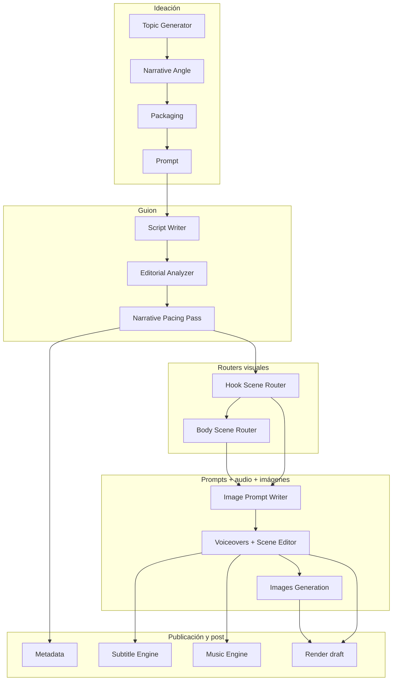

# Pipeline Videomaker — esquema y módulos

Documento de referencia para ver **qué es imprescindible**, **qué es auxiliar** y **en qué orden** aparecen los pasos en Create. No elimina módulos: solo organiza la lectura del flujo.

## Orden en la UI (barra lateral Create)

| # | Paso | Rol |
|---|------|-----|
| 1 | **Topic Generator** | Tema, ángulo, idioma de salida |
| 2 | **Narrative Angle** | Ángulo narrativo |
| 3 | **Packaging (Título + Miniatura)** | Empaquetado hook-first (`packaging.json`) |
| 4 | **Prompt** | Brief creativo (`prompt.json`) |
| 5 | **Script Writer** | Guion (`guion.txt`, `pipeline/script.txt`) |
| 6 | **Editorial Analyzer** | Análisis editorial del guion |
| 7 | **Narrative Pacing Pass** | Ritmo y reescritura del guion |
| 8 | **Hook Scene Router** | Micro-beats del gancho (`narrator_visible`) |
| 9 | **Body Scene Router** | B-roll / sub-planos del cuerpo |
| 10 | **Image Prompt Writer** | Prompts; **avatar híbrido** (`avatar` + `insert`) |
| 11 | **Voiceovers Generation** | TTS + Scene Editor → `narracion.wav` + reconciliación |
| 12 | **Images Generation** | PNG + manifest (`duration_ms` real) |
| 13 | **Music Engine** | Beats anclados al audio real |
| 14 | **Metadata** | Descripción, tags, capítulos |
| 15 | **Subtitle Engine** | Whisper sobre `narracion.wav` |
| 16 | **Render draft** | Montaje `draft.mp4` |

### Al final del listado (auxiliares)

| Paso | Rol |
|------|-----|
| **Voiceover Engine** | Plan de locución (spine); distinto de generar WAV |

### Fuera del manifest de pasos

- **Scene Editor**: vive dentro de Voiceovers Generation; edita chunks, audio y plan visual por bloque.
- **Analyse / transcripts**: entrada de investigación (no es un `step_id` del pipeline).
- **Prompt Library / Script templates**: catálogos reutilizables.

## Flujo de datos (esquema)

## Qué es imprescindible vs. “de más”

| Imprescindible para un vídeo publicable | Opcional / refinamiento | Puede sentirse “de más” si no lo usas |
|----------------------------------------|-------------------------|--------------------------------------|
| Topic Generator → Prompt → Script Writer | Narrative Angle, Editorial Analyzer, Narrative Pacing Pass | Pasos de diagnóstico si ya tienes guion importado |
| Image Prompt Writer → Voiceovers → Images Generation | Hook + avatar híbrido, Editorial/Pacing | Body Router; Voiceover Engine (solo plan) |
| Render draft | Subtitle Engine, Music Engine | Si montas fuera o sin música automática |
| Metadata (título, descripción, tags) | Miniaturas OpenAI en Metadata | Thumbnails si las diseñas fuera |

**Regla práctica (mínimo):**  
`Topic → Prompt → Script → IPW → Voiceovers → Images → Render` (+ Metadata).

**Producción completa:** ver numeración 1–16 en la tabla del sidebar y [`README.md`](../README.md) (flujo, reglas, atajos).

**Script Writer (UI):** `guion.txt` en sesión; **Guardar en…** exporta copia externa.

## Avatar híbrido (Image Prompt Writer + Hook Scene Router)

Combina **branding del personaje** (preset / `scene_visual_settings.json`) con **retención del gancho** (`hook_scene_router.json`). No sustituye uno al otro: intercala dos pistas en `image_prompts.json`.

| Pista | `track` | Origen | Cuándo en el gancho |
|-------|---------|--------|---------------------|
| Personaje (Alex, etc.) | `avatar` | Avatar Prompt Writer (segmentos `act: hook` + body/cta) | Beat con `narrator_visible: true` |
| B-roll de apoyo | `insert` | Hook Router (`resolve_image_prompt_for_beat`) | Beat con `narrator_visible: false` |

**Flujo**

1. Pacing Pass → Hook Scene Router → `micro_beats[]` (`narrator_visible`).
2. Image Prompt Writer: **modo avatar** ON → **Start step**.
3. Voiceovers: TTS + **Unificar narracion.wav** → reconciliación (`image_prompt_timing_reconcile.py`).
4. **Enviar a Images Generation** → manifest con `duration_ms` (mín. 0,8 s/plano).
5. Images + Render.
6. Si regeneras el hook: **«Fusionar inserts del Hook (híbrido)»** → voiceovers/reconciliar de nuevo.

Sin `hook_scene_router.json`, el paso solo etiqueta `track: avatar` (comportamiento clásico).

Código: `_run_step_image_prompt_writer` en `pipeline/runner.py`; push desde hook en `api_router.py` (rama `use_avatar`).

### Sincronía temporal (Hook estimado vs. TTS real)

| Fase | Qué define el tiempo |
|------|----------------------|
| Hook Scene Router | `start_sec_estimated` / `weight` relativo (texto, WPM) |
| Voiceovers + Scene Editor | Duración real por chunk → `audio_timeline.json` |
| Reconciliación | `image_prompt_timing_reconcile.py` escribe `duration_ms` + `timing.audio_start_s` en prompts y manifest |

Se dispara al unificar `narracion.wav`, al enviar a Images Generation, al renderizar, o con `POST /api/pipeline/image-prompts/reconcile-timing`. El Render usa `duration_ms` del manifest / chunks, no los segundos estimados del router. **Piso mínimo 0,8 s** por plano: inserts muy ligeros (p. ej. peso 0,1) roban tiempo al avatar vecino para evitar flashes.

## Artefactos por paso

| `step_id` | Archivo principal |
|-----------|-------------------|
| `topic_generator` | `pipeline/topic_generator.json` |
| `narrative_angle` | `pipeline/narrative_angle.json` |
| `packaging` | `pipeline/packaging.json` |
| `prompt` | `pipeline/prompt.json` |
| `script_writer` | `pipeline/script.txt`, `guion.txt` |
| `editorial_analyzer` | `pipeline/editorial_analysis.json` |
| `narrative_pacing_pass` | `pipeline/script.txt` (actualizado) |
| `voiceovers_generation` | `pipeline/voiceovers.json` + audio en Scene Editor |
| `image_prompt_writer` | `pipeline/image_prompts.json` (modo avatar híbrido: `track` `avatar` \| `insert`, `timing` desde hook) |
| `images_generation` | `pipeline/images_generation.json`, `pipeline/images/*.png` |
| `metadata` | `pipeline/metadata.json` |
| `subtitle_engine` | `pipeline/subtitles_plan.json`, `pipeline/subtitles.srt`, `pipeline/audio_timeline.json` |
| `music_engine` | `pipeline/music_plan.json` (beats con `start_s`/`end_s`) |
| `render_draft` | `draft.mp4` |
| `hook_scene_router` | `pipeline/hook_scene_router.json` (`micro_beats`, retención; entrada del merge híbrido) |
| `body_scene_router` | `pipeline/body_scene_router.json` (`macro_beats`; merge en IPW con `router_driven`) |
| `voiceover_engine` | `pipeline/voiceover_plan.json` |

## Ejecución automática vs. sidebar

- **Barra lateral** (`PIPELINE_STEPS`) y **Start pipeline** (`PIPELINE_RUN_ORDER`) comparten el mismo orden lógico: IPW → Voiceovers → Images (reconciliación entre 11 y 12).

Definición: `apps/backend/videomaker/pipeline/models.py`.

## Qué no afecta al proceso (resumen)

Lista ampliada por módulo (recibe / genera / envía / **poco útil hoy**): sección **Funcionamiento** del [`README.md`](../README.md).
